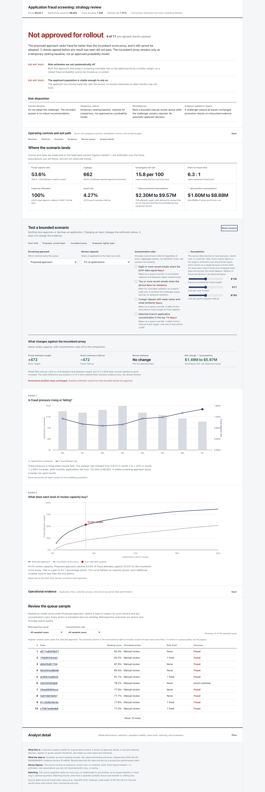

# Application Fraud Strategy Portfolio

**A fraud model can catch more fraud and still be the wrong model to ship.**

This project evaluates an application-fraud challenger, converts the evidence into a capacity-bounded
review strategy, and records a refusal when pre-agreed governance checks fail. The result is not a model
demo. It is a decision product for a fraud strategy owner.

[Current public dashboard](https://vaibhavkhuranaaa.github.io/application-fraud-strategy-portfolio/) ·
[Originations strategy](docs/originations-strategy.md) ·
[Evaluation report](evaluation/report.md) ·
[Release evidence](docs/release-readiness.md)

Status: the analytical workflow and risk-control decision product are verified and approved for the
public release. The challenger remains rejected and the evidence boundaries remain unchanged.

## What it does

At a fixed 5% review capacity, the proposed approach finds substantially more fraud than the incumbent proxy:

| Untouched month 7 | Incumbent proxy | Proposed approach | Difference |
| --- | ---: | ---: | ---: |
| Fraud caught | 294 | 766 | **+472** |
| Good customers reviewed | 4,548 | 4,076 | **-472** |
| Total review workload | 4,842 | 4,842 | 0 |

A fixed-seed paired row bootstrap places the additional fraud caught between **425 and 519** at 95%
confidence. The challenger catches more fraud in all five time-ordered folds, with differences from 439
to 474. This strengthens the ranking evidence and does not resolve the failed promotion checks.

The model is still **not approved for rollout**. It passes 9 of 11 promotion checks but fails both:

- **Calibration:** its intercept is 0.301 against an allowed absolute maximum of 0.10.
- **Population stability:** 16 feature-month PSI checks reach the automatic-promotion block level.

The incumbent score proxy remains only as a temporary ranking baseline. It is not an approved probability
model and may not make an automatic applicant decision. The recorded strategy is
`no robust recommendation`. No dashboard control can turn that refusal into approval.



The dashboard supports bounded scenario presets, review capacity, transparent concentration rules,
assumption-labelled economics, a same-capacity comparison, queue filters, and case-level drill-down. Its
risk view adds the temporary baseline disposition, uncertainty, four rule decisions, seven role-assigned controls,
and the evidence required to reopen the refusal.
[Technical evidence](docs/screenshots/dashboard-technical.png) and the
[390px phone view](docs/screenshots/dashboard-phone.png) carry the same boundaries.

## Architecture

```text
Six BAF files
    -> validation and typed local Parquet
    -> temporal baseline/challenger evaluation
    -> fixed promotion and strategy gates
    -> aggregate evidence JSON
    -> static decision workspace

Aggregate evidence
    -> optional PostgreSQL operating model
    -> review queue, monthly KPI, and daily suspect reporting
```

- Months 0 to 5 select the model, month 6 calibrates it, and month 7 opens once for final evaluation.
- PostgreSQL holds the optional operating model for scored applications, queues, KPI facts, and audit events.
- The public dashboard embeds the complete reviewed evidence and needs no runtime database or server.
- Power BI source provides a semantic model, measures, and report specification, but has not been verified
  in Power BI Desktop.
- Azure Terraform is an unapplied scale mapping. No Azure resource or paid capacity exists.

See [architecture](docs/architecture.md), [scope](docs/scope.md), and the
[risk control framework](docs/risk-control-framework.md).

## Evaluation

| Evidence | Result | Decision supported |
| --- | --- | --- |
| Proposed approach PR-AUC | 0.2129 | Better ranking than the corrected linear baseline at 0.1787 |
| Fraud capture at 5% capacity | 53.6% | More fraud found without increasing review workload |
| Paired PR-AUC lift interval | 0.0219 to 0.0464 | Ranking gain exceeds fixed-seed sampling noise |
| Paired fraud-catch interval | +425 to +519 at 5% capacity | The +472 difference remains positive under paired row resampling |
| Promotion checks | 9 of 11 pass | Challenger remains rejected because two blocking checks fail |
| Walk-forward capture | 49.0% to 54.2% across five folds | Advantage persists across time-ordered folds |
| Linking fixture | F1 0.953 minimum at 15% corruption, zero false merges | Fixture matcher passes; no BAF identity claim follows |
| Responsive gate | 390 to 1680px, zero overflow, 5.11 minimum contrast | Dashboard is usable across supported layouts |
| Independent risk-product review | 9.25 of 10, every dimension at least 1.65 of 2 | Meets the portfolio decision-product threshold, not production readiness |

Three corrections make the evidence more credible:

1. A chance-level linear comparator was replaced with a class-weighted regularized logistic baseline.
2. The incumbent score mapping was fixed so one application scores identically alone or in a batch.
3. The runtime container moved to distroless after the original image exposed critical and high findings.

The complete local suite passes 93 tests. The release harness also verifies policy reproduction, dependency
and secret scans, single-record scoring, batch scoring, analytics-extract regeneration, and SQL safety.

## Limits

- BAF is privacy-preserving synthetic account-opening data, not observed production lending outcomes.
- Economic figures are sensitivity assumptions, not realised savings, losses, or return.
- BAF rows contain no recoverable identity relationships. Matching evidence comes from a separate synthetic
  fixture with held-out truth.
- The dashboard supports governance review; it never approves, declines, retrains, or promotes anything.
- Groups with fewer than 200 fraud cases are withheld rather than displayed as unstable estimates.
- Power BI source is authored but unverified in Desktop. No `.pbix` or Power BI Service report exists.
- Azure Terraform is authored but has never been planned against a subscription or applied.

## Scaling

The static dashboard is the production-shaped choice for this public decision: all 1,152 bounded policy
combinations fit in a reviewed payload, so controls are lookups and hosting stays free. Row-level work belongs
in PostgreSQL, where queues and KPI facts can be filtered without publishing source data. The Azure design is
only the next boundary if a real production need, owner, label feed, and budget are approved.

## Run locally

```bash
UV_CACHE_DIR=/private/tmp/fraud-uv-cache uv sync
PYTHONPATH=src uv run pytest
python3 -m http.server 8060 --directory dashboard
```

Open `http://127.0.0.1:8060`. The dashboard also works when `dashboard/index.html` is opened directly.

Evidence-producing workflows require the ignored source data and local model artifacts. Rebuild and verify
the public surface with:

```bash
PYTHONPATH=src uv run python scripts/build_risk_governance.py
PYTHONPATH=src uv run python scripts/build_dashboard_data.py
PYTHONPATH=src uv run python scripts/ux_check.py
PYTHONPATH=src uv run python scripts/release_check.py --skip-container --skip-recovery
```

## Repository map

| Path | Purpose |
| --- | --- |
| `dashboard/` | Static stakeholder decision workspace |
| `src/fraud_strategy/` | Curation, modeling, linking fixture, strategy, and operations |
| `evaluation/` | Aggregate evidence and gate results |
| `db/` | PostgreSQL Fraud Schema and migrations |
| `powerbi/` | Unverified Power BI semantic source and report contract |
| `docs/samples/monthly-fraud-kpi.xlsx` | Five-sheet management workbook sample |
| `infra/azure-staging/` | Unapplied scale mapping |

## Attribution

This project uses the **Bank Account Fraud Dataset Suite** by Sérgio Jesus, José Pombal, Duarte Alves,
André F. Cruz, Pedro Saleiro, Rita P. Ribeiro, João Gama, and Pedro Bizarro on behalf of Feedzai,
presented at NeurIPS 2022. The accountable human determined that the Kaggle distribution's
**CC BY-NC-SA 4.0** statement governs this non-commercial use. Raw data is not committed.

Source: `https://kaggle.com/datasets/sgpjesus/bank-account-fraud-dataset-neurips-2022`
